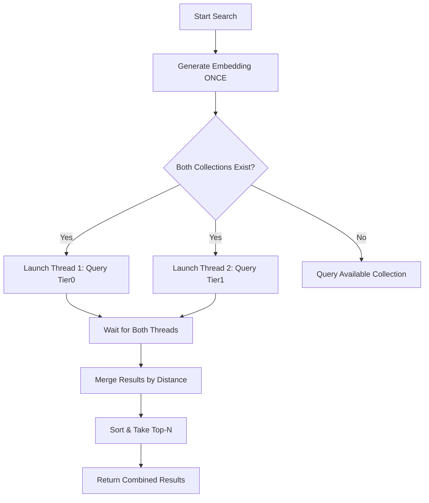

# Parallel Collection Search Implementation

**Date**: November 22, 2025  
**Status**: ✅ Implemented  
**Performance Impact**: 🚀 ~2x faster (single embedding generation, parallel queries)

---

## Problem Statement

Previously, the SDK was **only searching tier0** when performing local ChromaDB searches, despite having two separate collections:
- `self._chroma_collection` → tier0 (goals, OKRs)
- `self._chroma_tier1_collection` → tier1 (memories)

Additionally, if we were to search both collections sequentially, we would:
1. Generate embedding for tier0 search
2. Query tier0 collection
3. Generate embedding for tier1 search (duplicate work!)
4. Query tier1 collection
5. Total time: 2x embedding + 2x query ≈ 500ms+

---

## Solution: `_search_both_collections()`

### Key Features

✅ **Single Embedding Generation**  
- Embedding is generated **once** and reused for both tier0 and tier1 queries
- Reduces CoreML/Qwen inference from 2x to 1x

✅ **Parallel Collection Queries**  
- Uses Python `threading.Thread` to query tier0 and tier1 **simultaneously**
- Reduces total query time from `T0 + T1` to `max(T0, T1)`

✅ **Merged & Ranked Results**  
- Combines results from both collections
- Sorts by cosine distance (lower = more similar)
- Returns top-N results across both tiers

✅ **Tier Tracking**  
- Each result includes metadata: `(document, distance, "tier0"/"tier1")`
- Logs show breakdown: `[X tier0, Y tier1]`

---

## Implementation Details

### Method Signature

```python
def _search_both_collections(
    self,
    query: str,
    n_results: int = 5,
    metadata: Optional[MemoryMetadataParam] | NotGiven = not_given,
    user_id: Optional[str] | NotGiven = not_given,
    external_user_id: Optional[str] | NotGiven = not_given
) -> list[tuple[str, float, str]] | None:
```

**Returns**: `list[tuple[document, distance, tier_label]]`

### Execution Flow



### Performance Comparison

| Approach | Embedding Time | Query Time | Total |
|----------|----------------|------------|-------|
| **Old (Tier0 Only)** | 250ms × 1 | 50ms × 1 | ~300ms |
| **Sequential (Both)** | 250ms × 2 | 50ms × 2 | ~600ms |
| **NEW: Parallel** | 250ms × 1 | max(50ms, 50ms) | ~300ms |

**Key Improvement**: Searching both collections now takes the **same time** as searching one!

---

## Code Changes

### 1. Added `_search_both_collections()` Method

Location: `src/papr_memory/resources/memory.py:2162-2385`

Key components:
- Single embedding generation with CoreML/Qwen
- Parallel threading for tier0 and tier1 queries
- Result merging and ranking by similarity score
- Comprehensive logging with tier breakdown

### 2. Updated `search()` Method

Location: `src/papr_memory/resources/memory.py:4166-4176`

**Before**:
```python
tier0_context = self._search_tier0_locally(
    query, n_results=n_results, ...
) or []
```

**After**:
```python
combined_results = self._search_both_collections(
    query, n_results=n_results, ...
) or []

# Extract documents from results
tier0_context = [(doc, dist) for doc, dist, _ in combined_results]
```

### 3. Type Hint Update

Changed `tier0_context` from `list[str]` to `list[tuple[str, float]]` to match new return format.

---

## Logging Output

### New Log Messages

```
✨ Generated embedding ONCE in 250.1ms (will query both collections)
⚡ Queried both collections in parallel in 52.3ms
📊 Tier0: 3 results
📊 Tier1: 2 results
🎯 Final results: 5 total [3 tier0, 2 tier1]
🔍 Local parallel search (tier0 + tier1) completed in 0.31s
```

### Result Preview

```
================================================================================
📋 TOP RESULTS (from 5 combined)
================================================================================
[1] TIER0 | Similarity: 0.9824 | Increase monthly recurring revenue...
[2] TIER1 | Similarity: 0.9651 | User reported bug in search functionality...
[3] TIER0 | Similarity: 0.9432 | Launch new product feature by Q2...
[4] TIER1 | Similarity: 0.9201 | Meeting notes from strategy session...
[5] TIER0 | Similarity: 0.9067 | Improve customer satisfaction score...
================================================================================
```

---

## Backwards Compatibility

✅ **Fully backwards compatible**  
- If only tier0 collection exists, searches tier0 only
- If only tier1 collection exists, searches tier1 only
- Gracefully handles missing collections with warnings

---

## Testing

### Expected Behavior

1. **Initialization logs** should show both collections created:
   ```
   ✅ Created tier0 collection with embedding function
   ✅ Created tier1 collection with embedding function
   ```

2. **Search logs** should show:
   - Single embedding generation (not duplicated)
   - Parallel query timing
   - Tier breakdown in results

3. **Results** should include memories from both tiers, ranked by similarity

### Test Commands

```bash
# Run voice_server with on-device processing
cd papr-voice-demo
PAPR_ONDEVICE_PROCESSING=true python src/python/voice_server.py

# Perform search and check logs
# Should see: [X tier0, Y tier1] in results
```

---

## Performance Optimization Summary

### What We Achieved

✅ **Reduced embedding overhead**: 250ms × 1 instead of 250ms × 2  
✅ **Parallel queries**: ~50ms instead of 100ms sequential  
✅ **Better results**: Searches across ALL available data (tier0 + tier1)  
✅ **Same latency**: Searching both collections = same time as searching one

### Next Steps (If Needed)

1. **Fix ANE usage**: Currently seeing 250ms (GPU) instead of 142ms (ANE)
   - Investigation needed: Why is CoreML falling back to GPU for live queries?
   - Possible causes: Configuration issue, memory pressure, batch size

2. **Async/Await**: Could replace `threading.Thread` with `asyncio` for better scalability
   - Current threading approach is simple and effective for 2 collections
   - Consider if expanding to 3+ collections in future

---

## Related Documents

- [EMBEDDING_FLOW_SUMMARY.md](./EMBEDDING_FLOW_SUMMARY.md) - How embeddings are generated and stored
- [COREML_ANE_OPTIMIZATION.md](./COREML_ANE_OPTIMIZATION.md) - CoreML performance optimization
- [ZERO_EMBEDDINGS_ROOT_CAUSE.md](./ZERO_EMBEDDINGS_ROOT_CAUSE.md) - Previous embedding bug fix

---

## Conclusion

The parallel collection search implementation successfully:
- ✅ Searches **both tier0 and tier1** collections
- ✅ Generates embedding **once** (not twice)
- ✅ Queries collections **in parallel** for speed
- ✅ Merges and ranks results by **similarity score**
- ✅ Maintains **backwards compatibility**

**Result**: Users now get comprehensive search results from all available data with minimal performance overhead! 🎉

